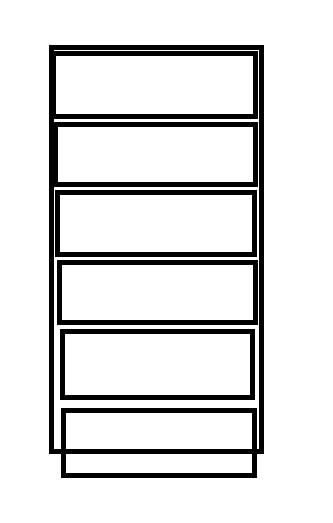

实现自定义的通用的LayoutManager，但是卡住了，遂看下Android 官方的几种LayoutManager是如何优雅实现的，大致的以及一些细节都看懂了，但是还是没找到什么好办法解决自己的问题，不如趁着热度把自己的分析过程写下来，也给其他需要的Androider.其实真的要对RecyclerView有个全面的认识，其实LayoutManager、Adapter、动画以及测量流程等细节都是要清楚的，因为虽然说RV给人使用上非常灵活解耦，但是其实内部也是这几者的紧密配合才达到的效果，所以有一点不明白其他地方可能也就会很模糊看不下去。也不细分章节了，就按照滚动的流程来写。至于为什么从滚动开始分析，是因为看源码还是讲究切入点，从RecyclerView的滑动开始是最佳切入点，很直观，要是第一次直接就从onLayoutChildren看起，我觉得看不了几行就得放弃。当然这篇文章的内容很多没说清楚的其实都是onLayoutChildren的一些逻辑，所以都略过了，只关注滑动。

由于自定的LayoutManager如果要(肯定要，不然还定义啥)支持滚动都必须至少重写以下两个方法中的一个，并且返回true，分别表示支持垂直滚动和水平滚动
```java
 public boolean canScrollHorizontally() {
            return true;
        }
 public boolean canScrollVertically() {
            return true;
        }
```
在发生滚动的时候，会在以下两个方法回调滚动的距离dy/dx
```java
    public int scrollVerticallyBy(int dy, Recycler recycler, State state) {
            return 0;
        }

    public int scrollHorizontallyBy(int dx, Recycler recycler, State state) {
            return 0;
        }
```
这里我们从LinearLayoutManager的垂直滚动分析起，进入scrollBy方法,
```java
    int scrollBy(int dy, RecyclerView.Recycler recycler, RecyclerView.State state) {
        if (getChildCount() == 0 || dy == 0) {
            return 0;
        }
        //滚动发生时，是需要回收View的
        mLayoutState.mRecycle = true;
        ensureLayoutState();
        //手指向上滑动时dy>0
        final int layoutDirection = dy > 0 ? LayoutState.LAYOUT_END : LayoutState.LAYOUT_START;
        final int absDy = Math.abs(dy);
        //更新LayoutState
        updateLayoutState(layoutDirection, absDy, true, state);
        final int consumed = mLayoutState.mScrollingOffset
                + fill(recycler, mLayoutState, state, false);
        if (consumed < 0) {
            if (DEBUG) {
                Log.d(TAG, "Don't have any more elements to scroll");
            }
            return 0;
        }
        final int scrolled = absDy > consumed ? layoutDirection * consumed : dy;
        //layout view结束，所有View整体平移；这里需要注意的是LLM并非是从头到尾一个个layout view，而是先根据偏移把需要回收的view回收掉，会显示的view显示出来，最后进行整体的平移。想一想这样效率确实要高
        mOrientationHelper.offsetChildren(-scrolled);
        if (DEBUG) {
            Log.d(TAG, "scroll req: " + dy + " scrolled: " + scrolled);
        }
        mLayoutState.mLastScrollDelta = scrolled;
        return scrolled;
    }
```
写了部分注释，具体分析一下updateLayoutState方法
分析这个方法前，先看下LayoutState这个类，了解一下我们需要关注的几个重要参数的含义

mRecycle 表示是否需要回收View,滑动情况下这个值是true，但是在有item 添加删除的情况是false，因为锚点什么的得靠view来确定，不能回收

mOffset   layout View时候的起始坐标(垂直方向的LinearLayoutManager 表示y值)，e.g.比如发生滑动后，下一个item需要显示出来，那么mOffset的值就等于最后一个可见item的bottom值(不考虑margin，向上滑动)

mAvailable 表示可用距离，在layout View的时候用到

mCurrentPosition  表示获取View的起始索引，在layout View的时候循环取View的时候用到

mItemDirection  获取item 数据的方向，是从前到后（值为1），还是从后往前（值为-1），本篇分析的是正序情况

mExtra 在LayoutManager支持predictive动画的时候这个值很有用，具体的需要了解RV的动画机制才明白这个值怎么回事，简单的说就是即使一个item此时(当他即将进入RV可见范围时)对用户不可见，但是还是得把他layout出来，虽然已经超出了RV的边界用户看不到，这样做的目的是为了更好的动画体验（因为需要两次layout，一次pre-layout 一次post-layout来确定动画的起始和终止位置，不然就只能做最简单的fadeIn fadeOut。只有当item add remove发生时才有值，一般为0

再回过来看updateLayoutState方法(并不喜欢贴太长串的代码。。。)
```java
     private void updateLayoutState(int layoutDirection, int requiredSpace,
            boolean canUseExistingSpace, RecyclerView.State state) {
        // If parent provides a hint, don't measure unlimited.
        mLayoutState.mInfinite = resolveIsInfinite();
        mLayoutState.mExtra = getExtraLayoutSpace(state);
        mLayoutState.mLayoutDirection = layoutDirection;
        int scrollingOffset;
        if (layoutDirection == LayoutState.LAYOUT_END) {
            mLayoutState.mExtra += mOrientationHelper.getEndPadding();
            // get the first child in the direction we are going
            final View child = getChildClosestToEnd();
            // the direction in which we are traversing children
            mLayoutState.mItemDirection = mShouldReverseLayout ? LayoutState.ITEM_DIRECTION_HEAD
                    : LayoutState.ITEM_DIRECTION_TAIL;
            mLayoutState.mCurrentPosition = getPosition(child) + mLayoutState.mItemDirection;
            mLayoutState.mOffset = mOrientationHelper.getDecoratedEnd(child);
            // calculate how much we can scroll without adding new children (independent of layout)
            scrollingOffset = mOrientationHelper.getDecoratedEnd(child)
                    - mOrientationHelper.getEndAfterPadding();

        } else {
            final View child = getChildClosestToStart();
            mLayoutState.mExtra += mOrientationHelper.getStartAfterPadding();
            mLayoutState.mItemDirection = mShouldReverseLayout ? LayoutState.ITEM_DIRECTION_TAIL
                    : LayoutState.ITEM_DIRECTION_HEAD;
            mLayoutState.mCurrentPosition = getPosition(child) + mLayoutState.mItemDirection;
            mLayoutState.mOffset = mOrientationHelper.getDecoratedStart(child);
            scrollingOffset = -mOrientationHelper.getDecoratedStart(child)
                    + mOrientationHelper.getStartAfterPadding();
        }
        mLayoutState.mAvailable = requiredSpace;
        if (canUseExistingSpace) {
            mLayoutState.mAvailable -= scrollingOffset;
        }
        mLayoutState.mScrollingOffset = scrollingOffset;
    }
```
前面几行就是简单的赋值更新状态，然后是根据layoutDirection的方向进行其他参数的计算，我们这里是分析的手指上滑，对应的layoutDireciton是LAYOUT_END，我们进入layoutDirection == LayoutState.LAYOUT_END成立的情况下去看：

 1.通过getChildClosestToEnd方法拿到RV最接近End的child(如果是水平布局，那么end就是RV的right，垂直布局end就是RV的bottom)

 2.根据mShouldReverseLayout变量给mItemDirection赋值，我们一般都不使用逆序布局，所以mItemDirection的值是ITEM_DIRECTION_HEAD，也就是说待会在fill方法内部取child来放的时候是正序，也就是从前往后依次取，反之亦然

 3.根据刚才取到的child获取到其在adapter中的位置，加上mItemDirection后赋值给mCurrentPosition，这个好理解，mCurrentPosition表示的就是取child的开始索引，LayoutState里面有个next方法就是这么做的，可以看下代码

 ```java
        View next(RecyclerView.Recycler recycler) {
            if (mScrapList != null) {
                return nextViewFromScrapList();
            }
            final View view = recycler.getViewForPosition(mCurrentPosition);
            mCurrentPosition += mItemDirection;
            return view;
        }
 ```
 4.给mOffset赋值，也就是下图最后一个item的bottom值，是后续依次放child的起始坐标
 

 5.至于scrollingOffset就是上面这张图里面最后一个item底部距离RV底部的距离，官方也有注释----"不需要添加新的children的情况下滚动的最大距离"-----也就是说最后一个item刚好完全滚进来，但是又不会有新的item滚进来的意思

 6最后给mAvailable赋值为requiredSpace，也就是此次滚动的距离,然后判断canUseExistingSpace为true就减去刚才的scrollingOffset；这里为什么要减去这个scrollingOffset呢
  ，其实就是把这个零头减掉方便计算而已，最后一句mScrollingOffset又把scrollingOffse
  t保存起来了。最后所有child都放置好之后，返回消耗的滑动距离时候，在scrollBy方法那里
  最后又把这个值加上去了，就这句：

  ```java
     final int consumed = mLayoutState.mScrollingOffset
                + fill(recycler, mLayoutState, state, false);
  ```

  好了，这个方法看完了，进去fill方法，没有贴全部的代码，还是一块一块看紧凑点

```java
        if (layoutState.mScrollingOffset != LayoutState.SCROLLING_OFFSET_NaN) {
            // TODO ugly bug fix. should not happen
            if (layoutState.mAvailable < 0) {
                layoutState.mScrollingOffset += layoutState.mAvailable;
            }
            recycleByLayoutState(recycler, layoutState);
        }
```
这句确实不太明白什么意思也不敢说我现在看明白了。外层这个if是为了避开首次初始化的情况，只有正常滑动的情况时候才会进来，但是滑动情况下 layoutState.mAvailable < 0 这个条件只有在滑动距离过小不足以把最后一个item的底部完全滑进来的情况才满足，不过看官方的注释好像是有bug，可能就做了一个防御性的if判断，防止特殊情况发生把，就假设这个条件满足了，不做if里面的处理，好像也不会发生什么问题把，不过回头想一下mScrollingOffset这个字段的意思是“在不需要添加新的View时候能滑动的最大距离”，按照这么理解，当mAvailable<0时候，说明滑动距离太小，没法把item底部全滑进来，最多也就只能滑动此次滑动的距离，所以这么处理之后mSrollingOffset就是此次滑动距离；所以这个TODO注释看的挺烦的，还以为是bug，让人很纠结是个什么bug-_-，最后recycleByLayoutState方法回收了一下此次滚动发生之后会越界不见的View

```java
       private void recycleByLayoutState(RecyclerView.Recycler recycler, LayoutState layoutState) {
        if (!layoutState.mRecycle || layoutState.mInfinite) {
            return;
        }
        if (layoutState.mLayoutDirection == LayoutState.LAYOUT_START) {
            recycleViewsFromEnd(recycler, layoutState.mScrollingOffset);
        } else {
            recycleViewsFromStart(recycler, layoutState.mScrollingOffset);
        }
    }
```
根据滑动方向选择是从后往前回收还是从前往后回收，我们考虑手指上滑，所以可能会有头部的View出界被滑出去，所以是调用的recycleViewsFromStart方法

```java
  private void recycleViewsFromStart(RecyclerView.Recycler recycler, int dt) {
        if (dt < 0) {
            if (DEBUG) {
                Log.d(TAG, "Called recycle from start with a negative value. This might happen"
                        + " during layout changes but may be sign of a bug");
            }
            return;
        }
        // ignore padding, ViewGroup may not clip children.
        final int limit = dt;
        final int childCount = getChildCount();
        if (mShouldReverseLayout) {
            for (int i = childCount - 1; i >= 0; i--) {
                View child = getChildAt(i);
                if (mOrientationHelper.getDecoratedEnd(child) > limit
                        || mOrientationHelper.getTransformedEndWithDecoration(child) > limit) {
                    // stop here
                    recycleChildren(recycler, childCount - 1, i);
                    return;
                }
            }
        } else {
            for (int i = 0; i < childCount; i++) {
                View child = getChildAt(i);
                if (mOrientationHelper.getDecoratedEnd(child) > limit
                        || mOrientationHelper.getTransformedEndWithDecoration(child) > limit) {
                    // stop here
                    recycleChildren(recycler, 0, i);
                    return;
                }
            }
        }
    }
```
看代码的第一句，如果dt<0就直接返回结束了，这也解释了为什么前面的纠结为什么当mAvailable < 0时候让mScrollingOffset加上mAvailable,就是为了让这里传入的dt是正值，也就是实际发生的滑动距离。由于不考虑逆序布局，直接看第二个for循环，其实这个循环要表达的意思是从头到尾遍历所有View直到找到一个滑动之后底部还没出界的View，那么在这个View之前的View全部要被回收掉。所谓回收掉就是把View节点从ViewHierarchy上删除掉了，但是被缓存起来了供重新绑定和重用。

继续往fill方法下面看，进入while循环
```java
      while ((layoutState.mInfinite || remainingSpace > 0) && layoutState.hasMore(state)) {
            layoutChunkResult.resetInternal();
            if (VERBOSE_TRACING) {
                TraceCompat.beginSection("LLM LayoutChunk");
            }
            layoutChunk(recycler, state, layoutState, layoutChunkResult);
            if (VERBOSE_TRACING) {
                TraceCompat.endSection();
            }
            if (layoutChunkResult.mFinished) {
                break;
            }
            layoutState.mOffset += layoutChunkResult.mConsumed * layoutState.mLayoutDirection;
            /**
             * Consume the available space if:
             * * layoutChunk did not request to be ignored
             * * OR we are laying out scrap children
             * * OR we are not doing pre-layout
             */
            if (!layoutChunkResult.mIgnoreConsumed || mLayoutState.mScrapList != null
                    || !state.isPreLayout()) {
                layoutState.mAvailable -= layoutChunkResult.mConsumed;
                // we keep a separate remaining space because mAvailable is important for recycling
                remainingSpace -= layoutChunkResult.mConsumed;
            }

            if (layoutState.mScrollingOffset != LayoutState.SCROLLING_OFFSET_NaN) {
                layoutState.mScrollingOffset += layoutChunkResult.mConsumed;
                if (layoutState.mAvailable < 0) {
                    layoutState.mScrollingOffset += layoutState.mAvailable;
                }
                recycleByLayoutState(recycler, layoutState);
            }
            if (stopOnFocusable && layoutChunkResult.mFocusable) {
                break;
            }
        }
```
只要还有可用空间就依次取 View 并添加layout出来，之后更新mOffset和mAvailable,当然如果某个view是有焦点的，那么直接结束

看LayoutChunk方法，顾名思义，就是layout小块的意思，就是把单个的itemView放置到合适的位置，并且传入了一个LayoutResult用于记录放置Item后的信息，就几个字段：
 mConsumed 消耗的距离
 mFinished 是否结束layout
 mIgnoreConsumed 是否忽略此次消耗的距离，滑动情况下这个值一直都是false
 mFocusable 当前item是否有焦点

 

